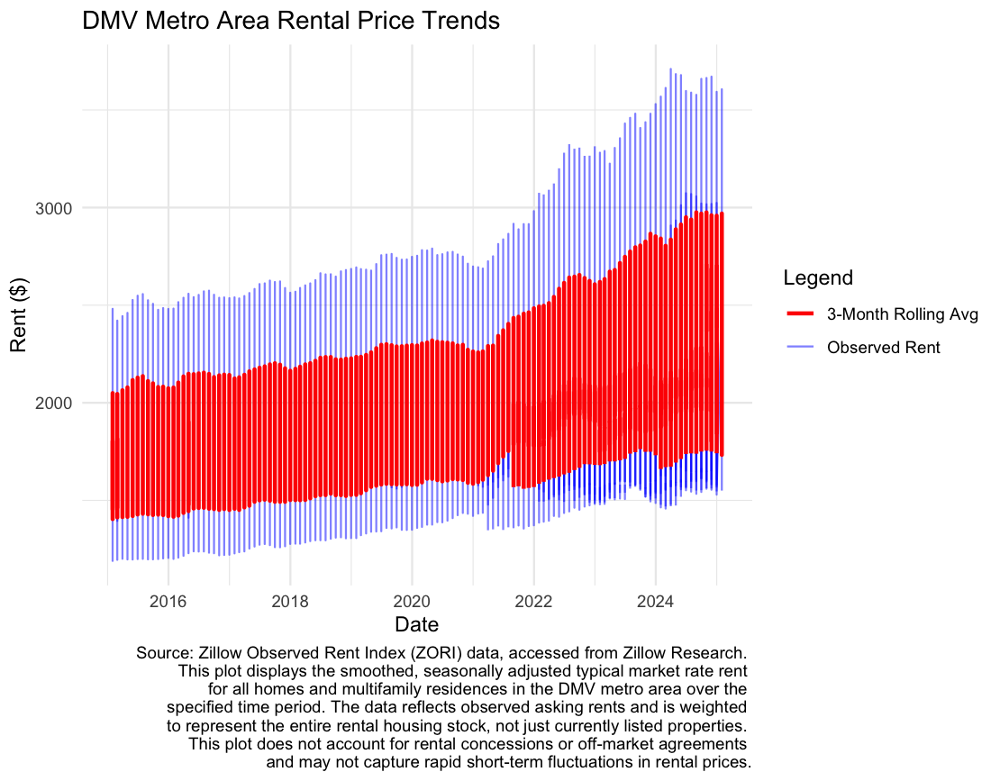

# DMV Metro Area Rental Price Trends

This repository contains an exploratory analysis of rental price trends in the Washington, D.C. metropolitan area using Zillow’s Observed Rent Index (ZORI) dataset. Originally a class assignment for *SO 440-01*: Research Techniques and Statistics, this project was expanded as a way to practice working with `R`, `ggplot2`, and time series data. This is not meant to be a rigorous economic analysis—it’s purely a learning exercise to improve data wrangling, visualization, and documentation skills.

## Data Source & Methodology

The dataset comes from Zillow Research and provides a smoothed, seasonally adjusted measure of typical market rent across different housing types. The ZORI metric reflects asking rents, weighted to represent the entire rental housing stock—not just currently listed properties. This means it does not account for off-market agreements, rental concessions, or rapid short-term fluctuations.

## Process

 • Filtered the dataset for the *Washington-Arlington-Alexandria*, *DC-VA-MD-WV* Metro Area.
 
 • Reshaped the data into long format to analyze rental prices over time.
 
 • Converted date values and calculated a 3-month rolling average to smooth short-term fluctuations.
 
 • Computed summary statistics (mean, median, standard deviation).
 
 • Visualized trends using `ggplot2` with a legend and formatted captions.

`R` was used instead of Excel because the dataset was structured as time series panel data, which required reshaping and rolling calculations that Excel wouldn’t handle as efficiently. The primary goal was to gain experience with R rather than produce a polished analysis.

## Files

 • `descriptiveStats_ZORDIcity.R` – R script for data wrangling and visualization.

 • `dmv_rentPtrends_ZORDI.png` – Final rental trends plot.

 • `seminar1_brief_ADLT_LATEX.rtf` – LaTeX write-up summarizing the analysis.

 • `seminar1_brief_ADLT.pdf` – PDF version of the write-up.

 • `City_zori_uc_sfrcondomfr_sm_month.csv` – Raw dataset.

 • `Seminar1_SO440.Rproj` – RStudio project file.

## References

• [Zillow Research Data](https://www.zillow.com/research/data/)

• [Zillow ZORI Methodology](https://www.zillow.com/research/methodology-zori-28515/)
